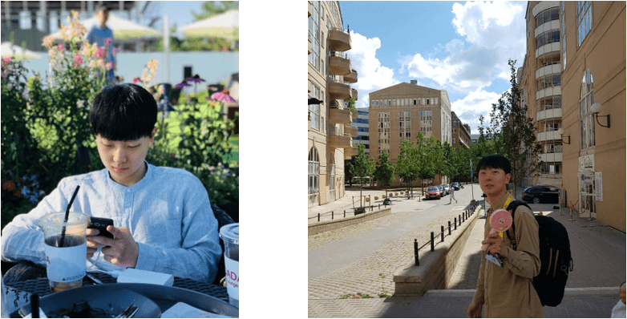

### Profile :

  B.S. in Biomedical Engineering, <a href="http://www.korea.ac.kr" target="_blank">Korea Univ.</a> 
  intelligent BioMEMS Laboratory (iBML)  
  [Present] 
  MS&Ph.D Integration Course in Computer Engineering, <a href="http://www.korea.ac.kr" target="_blank">Korea Univ.</a>
  Data Mining and Imformation Systems Laboratory (DMIS)

### Interests : 

  Machine Learning, Deep Learning, Biomedical Engineering, Computer Vision, Signal Proccessing

### Contact :
E-mail :    ljhyun33@korea.ac.kr 
<a href="{{ site.github.repo }}">Github</a>
<a href="{{ site.facebook }}">Facebook</a>
<a href="{{ site.linkedin }}">Linkedin</a>
<a href="{{ site.youtube }}">Youtube</a>

Wechat ID : Ant_LJH 

